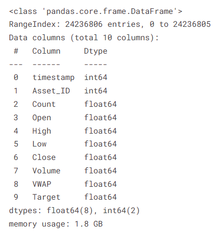

# 🚀 G-Research Crypto Forecasting

: 머신러닝 전문 지식을 활용하여 실제 암호화폐 시장 데이터 예측하기

### 📚 참고 자료

<aside>
💡

대회: https://www.kaggle.com/competitions/g-research-crypto-forecasting

참고한 노트북: 

https://www.kaggle.com/code/cstein06/tutorial-to-the-g-research-crypto-competition#Prediction-targets-and-evaluation

https://www.kaggle.com/code/iamleonie/time-series-interpreting-acf-and-pacf

</aside>

### **📌 대회 정리**

| 주제 | 14개 암호화폐의 단기 수익률 예측 |
| --- | --- |
| 주최 | G-Research, Cambridge Spark |
| 총 상금 | 총 $120,000   
1등 - $50,000 |
| 문제 유형 | 회귀(Regression) / 시계열 예측(Time-Series Forecasting) |
| 데이터 타입 |  |
| 평가 지표 | 가중치가 적용된 피어슨 상관계수 (Weighted Pearson Correlation) |
| 대회 시작 일시 | 2021년 11월 2일 |
| 대회 종료 일시 | 2022년 5월 3일 (우승자 발표) |
| 대회 참가 팀 | 약 1,946여  |

# 1️⃣ 대회 개요

매일 400억 달러 이상의 암호화폐가 거래되며, 이는 투자와 투기의 인기 있는 자산이다. 하지만 높은 변동성으로 인해 가격 예측이 매우 어려운 상황이다. 

14개 암호화폐의 단기 수익률 예측 모델 개발이 목표

### 🔑 주요 도전 과제

- 수많은 거래자가 동시에 거래를 진행하기 때문에 대부분의 신호가 일시적 → 지속적이고 의미있는 신호를 찾는 것이 어려움
- 과적합(Overfitting) 위험 → 지속적인 초과 수익(Alpha)를 찾기 어려움
- 비정상성 데이터(Non-Stationary) → 시장 환경이 계속 변화(변동성) 고려

### **⚒️ 데이터**

- 2018년 이후 고빈도 시장 데이터 제공



### ⛑️ 주의 사항

- Python 시계열 API를 사용해 모델이 시간을 앞지르지 않도록 해야 한다.

```
import gresearch_crypto
env = gresearch_crypto.make_env()   # initialize the environment
iter_test = env.iter_test()    # an iterator which loops over the test set and sample submission
for (test_df, sample_prediction_df) in iter_test:
    sample_prediction_df['Target'] = 0  # make your predictions here
    env.predict(sample_prediction_df)   # register your predictions
```

→ 이 API는 테스트 데이터와 예측 데이터가 시간 순서대로 처리되도록 설계. 모델은 과거 및 현재 데이터를 기반으로만 학습하고 예측하며 평가 시점 이후의 데이터를 참조하지 못하도록 제한

### 🧪 평가 방식

- 제출된 모델은 실시간 암호화폐 데이터에 적용됨
- 제출 마감 후 3개월 동안 수집된 실제 시장 데이터를 기반으로 모델의 예측 정확도(수익률 예측)가 평가됨

📌 즉, 훈련/검증 데이터와는 별도로, 완전히 미래 데이터를 기반으로 모델의 실전 성능을 측정

### 💡 평가 지표

- 가중치가 적용된 피어슨 상관계수(Weighted Pearson Correlation)
    - 피어슨 상관계수
        
         두 변수 간의 선형 관계를 측정하는 값 
        
        → +1에 가까우면 강한 양의 상관관계, -1에 가까우면 강한 음의 상관관계
        

### 📒 가중치된 피어슨 상관계수를 평가지표로 사용하는 이유

- ~~암호화폐 시장의 특성상 변동성이 높고, 데이터의 중요도가 시점별로 다름~~
- ~~거래량이 많은 시점의 데이터가 더 신뢰할 만한 정보를 포함할 가능성이 큼~~
- ~~단순 평균보다 가중치를 반영하면 모델의 예측력을 더욱 정밀하게 평가 가능~~
- 모든 암호화폐가 동일한 영향력을 갖지 않음
- 데이터셋에서 암호화폐별 가중치(Weight)가 제공됨 → 주요 자산일수록 평가 시 더 높은 영향력을 가짐
- 이를 위해 `asset_details.csv`에서 각 암호화폐별 가중치가 제공됨


# 2️⃣ 데이터 소개

| **timestamp** | Unix 타임스탬프 (1970-01-01 00:00:00 UTC 이후 초 단위 경과 시간), 60초 단위 데이터 |
| --- | --- |
| **Asset_ID** | 암호화폐를 식별하는 ID (예: 1 = Bitcoin) |
| **Count** | 해당 분(minute) 동안의 총 거래 횟수 |
| **Open** | 해당 분의 시작(개장) 가격 (USD) |
| **High** | 해당 분 동안의 최고 가격 (USD) |
| **Low** | 해당 분 동안의 최저 가격 (USD) |
| **Close** | 해당 분의 종료(종가) 가격 (USD) |
| **Volume** | 해당 분 동안의 매수/매도된 자산 수량 (USD 기준)  |
| **VWAP** | 거래량 가중 평균 가격 (Volumne Weighted Average Price) |
| **Target** | 15분 후 예상 로그 수익률 (Residual log-returns)  |

📌 추가 데이터: `asset_details.csv`파일에는 **Asset_ID**와 암호화폐 종류 매핑 정보 및 각 자산의 중요도를 나타내는 가중치(Weight)가 포함됨

| Asset_ID | Weight | Asset_Name |
| --- | --- | --- |
| 0 | 4.304065 | Binance Coin |
| 1 | 6.779922 | Bitcoin |
| 2 | 2.397895 | Bitcoin Cash |
| 3 | 4.406719 | Cardano |
| 4 | 3.555348 | Dogecoin |
| 5 | 1.386294 | EOS.IO |
| 6 | 5.894403 | Ethereum |
| 7 | 2.079442 | Ethereum Classic |
| 8 | 1.098612 | IOTA |
| 9 | 2.397895 | Litecoin |
| 10 | 1.098612 | Maker |
| 11 | 1.609438 | Monero |
| 12 | 2.079442 | Stellar |
| 13 | 1.791759 | TRON |

# 3️⃣ 튜토리얼 요약

## 1. 결측치 확인

- Target 열에서 Null 값을 가진 행: 750,338개
- 전체 데이터 행 수 대비 Null 값을 가진 행의 비율: 3.10%

## 2. 자산별 데이터 분포 시각화


## **3. 캔들스틱 차트 (Candlestick Charts)** 📈

- `Open`, `High`, `Low`, `Close` 데이터를 시각화하는 차트 형태로 주로 기술적 분석에 사용됨

### 차트 구성 요소

1. **바디(Body) → 시가(Open)와 종가(Close) 간 가격 범위**
    - 초록색: 종가가 시가보다 높음 (가격 상승 = Bullish)
    - 빨강색: 종가가 시가보다 낮음 (가격 하락 = Bearish)
2. **윗꼬리와 아랫꼬리(Wicks)** 
    - 해당 시간대 동안의 최고가(High)와 최저가(Low)를 보여줌
    - 꼬리의 길이는 변동성을 나타냄


---

## 4. 시계열 데이터 전처리 (Preprocessing)

### 💡 시간 누락 데이터 확인

- 암호화폐 데이터는 누락 시 NaN이 아니라, 아예 행 자체가 없음
- `timestamp` 간의 차이를 계산하여 누락된 시간 구간 탐지

`(eth.index[1:] - eth.index[:-1]).value_counts().head()`

→ 일정한 간격(60초)이 아닌 다양한 가격이 존재함을 확인 

### 🔄 시간 간격 보정

- `.reindex()`와 `method=’pad’`를 사용해 누락된 시점의 값을 이전 값으로 채움
- 인덱스를 60초 간격으로 강제 생성 → 균일한 시계열 데이터로 변환

## 5. 자산 가격 시각화 및 상관관계 탐색

### 💹 종가(Clost) 가격 시각

- BTC와 ETH의 종가(Close)를 각각 시각화
    
    → 시간에 따른 변동 추이를 직관적으로 비교 가능
    
- 또한, 특정 구간(예: 2021년 6월)만 필터링하여 비교 분석도 가능


📌 인사이트

⇒ 두 자산은 비슷한 시점에 상승/하락하는 경향이 있으며, 잠재적 상관관계 존재 

## 6. 로그 수익률 (Log Returns)

- 일반 수익률 (Returns)
    - 자산의 가격 변화를 분석하기 위해 가격 차이를 계산
    - 하지만 자산마다 가격 규모가 다르기 때문에, 단순 가격 차이만으로는 비교가 어려워 이를 해결하기 위해 ‘가격의 백분율 변화(수익률, Returns)’를 계산

### 🔍 왜 로그 수익률을 쓰는가?

- 일반 수익률은 가격 크기에 따라 왜곡될 수 있음
- 일반 수익률은 -100% 이하로 내려갈 수 없으나, 로그 수익률은 제한이 없다
- 로그 수익률은 가격 비율의 로그로 계산되어 시간적으로 가산적이며, 비율 기반 비교에 적합
- 🗒️로그 수익률 계산
    - 두 연속적인 가격의 비율에 대해 로그 값을 취해 계산
    - 첫 번째 값은 이전 데이터가 없기 때문에 로그 수익률이 비어 있게 되며, 이를 삭제

### 📊 BTC와 ETH 로그 수익률 비교

- 두 자산의 로그 수익률을 시각화
- 대체로 유사한 흐름을 보이지만, 상관관계는 일정하지 않음


⇒ 상관관계가 시간에 따라 상승과 하락을 반복하는 흐름을 보인다. 이는 두 자산 간의 관계가 일정하지 않고 동적이라는 것을 의미한다. (비정상성(Non-stationary) 특징)

📌 인사이트
→ 두 자산이 항상 동시에 움직이지 않음 

## 7. 타겟 변수 설정 (Returns Prediction)

### 🎯 목표: 가까운 미래의 수익률 예측

- 예측 타겟:
    
    
    
    `log(price t+16) / price(t+1)` → 미래 16분 후 가격과 미래 1분 후 가격의 로그 비율 
    
    - 이는 16분 후와 1분 후의 차이로 15분 간의 수익률을 나타냄

### 📗 시장 신호 제거

- 암호화폐는 전체 시장과 높은 상관성을 가짐
- 개별 자산의 수익률 예측 능력을 평가하기 위해, 시장의 영향을 제거한 개별 자산의 순수 수익률을 타겟으로 설정

## 8. 모델 구조 요약

- 자산별로 단일 모델을 돌리는 것보다,
    - 다중 출력 회귀 모델(Multi-output regression) 사용
        
        입력 데이터를 기반으로 여러 타켓 변수를 동시에 예측
        
- 하나의 입력으로 여러 자산의 수익률을 동시에 예측

---

https://www.kaggle.com/code/danofer/g-research-starter-0-361-lb

## 1. 메모리 사용량 최적화

: 데이터셋이 방대하기 때문에 메모리 사용량을 줄이기 위해 데이터 타입 최적화 

### ⚙️ 각 컬럼을 순회하면서 타입을 줄일 수 있는지 확인

- 정수형 컬럼 → `int8`, `int16`, `int32` 등 가능한 가장 작은 타입으로 반환
- 실수형 컬럼 → `float16`, `float32` 등으로 변환
- (문자열 컬럼은 처리하지 않음)

## 2. 피처 생성

| `upper_shadow` | 고가(High)와 종가/시가 중 큰 값의 차이 |
| --- | --- |
| `lower_shadow` | 종가/시가 중 작은 값과 저가(Low)의 차이 |
| `high_div_low` | 고가 ÷ 저가 ⇒ 변동 비율 |
| `open_sub_close` | 시가 - 종가 (차이) ⇒ 상승/하락 여부를 판단할 수 있는 지표 |
| `hour` | 특정 데이터가 기록된 시간 |
| `dayofweek` | 데이터가 기록된 요일 |
| `day` | 데이터가 기록된 날짜 |

## 3. 자산별 모델 학습

### 3.1 자산별 데이터 처리

- 자산 ID(Asset_ID)를 기준으로 데이터를 필터링하고 전처리
- LightGBM 회귀 모델을 사용하여 자산별 예측 모델 학습

### 3.2 학습 흐름

- 자산별로 데이터를 처리하고, 모델 학습 결과를 저장

<aside>
🔑

`for asset_id, asset_name in zip(df_asset_details['Asset_ID'], df_asset_details['Asset_Name']):
X, y, model = get_Xy_and_model_for_asset(df_train, asset_id)
models[asset_id] = model`

</aside>


## 4. 테스트 및 예측


💡Asset_ID가 0인 데이터에 대해 학습된 모델을 호출하여 예측한 값→ 이 값은 Target 값으로, 약 0.000947%의 가격 변화율을 의미

- 양수인 Target 값이므로 해당 암호화폐의 가격이 이전 시간 대비 미미하게 상승했음을 예측

<aside>
🔑

```
all_df_test = []

env = gresearch_crypto.make_env()
iter_test = env.iter_test()

for i, (df_test, df_pred)in enumerate(iter_test):
    for j , rowin df_test.iterrows():

        model = models[row['Asset_ID']]
        x_test = get_features(row)
        y_pred = model.predict([x_test])[0]

        df_pred.loc[df_pred['row_id'] == row['row_id'], 'Target'] = y_pred

# Print just one sample row to get a feeling of what it looks likeif i == 0and j == 0:
            display(x_test)

# Display the first prediction dataframeif i == 0:
        display(df_pred)
    all_df_test.append(df_test)

# Send submissionsenv.predict(df_pred)
```

</aside>

→ 테스트 데이터를 순차적으로 처리하여 각 자산에 대해 학습된 모델로 예측 수행

- 제출 템플릿에 예측 값을 기록하고 대회 환경에 제출

---

https://www.kaggle.com/code/code1110/gresearch-simple-lgb-starter#Feature-Engineering 📌

## 1. 학습 및 검증을 위해 기간 분리 (시계열 분할)

- 학습 기간: 2018년 1월 1일부터 2020년 9월 21일까지
- 검증 기간: 2020년 9월 22일부터 2021년 9월 21일까지

## 2. 파생 변수 생성

| `open2close` | 종가(Close)와 시가(Open)에 비해 얼마나 변동했는지를 나타내는 비율 |
| --- | --- |
| `high2low` | 최고가(High)와 최저가(Low)의 비율로, 가격 변동성을 나타냄 |
| `low2mean` | 최저가(Low)가 해당 시점 평균 가격(mean_price)에 비해 얼마나 낮은지 나타내는 비율 |
| `high2median` | 최고가(High)가 중앙값(median_price)에 비해 얼마나 높은지 나타내는 비율 |
| `low2median` | 최저가(Low)가 중앙값(median_price)에 비해 얼마나 낮은지 나타내는 비율 |
| `volumn2coun` | 거래량(Volume)을 거래 횟수(Count)로 나눈 값으로, 거래당 평균 거래량을 의미 |

## 3. 하이퍼파라미터 설정 및 피처 선택


## 4. 모델링 (LightGBM)

- 각 암호화폐 자산(Asset_ID)에 대해 독립적으로 학습된 LightGBM 모델 생성

### 4.1 개별 모델 학습 (14개 모델)

- 암호화폐마다 가격 변동성과 특성이 달라, 개별적으로 모델을 학습

### 4.2 통합 모델 학습 (1개 모델)

- 통합된 데이터에서 공통 패턴을 학습하고, 모든 Asset_ID를 하나의 모델로 처리
- 모든 자산에 대해 일관된 접근 방식 적용 가능

---

https://www.kaggle.com/code/iamleonie/time-series-interpreting-acf-and-pacf

# 1️⃣ ACF (Autocorrelation Function, 자기상관 함수)

: 이전 시점의 값과 현재 값 사이의 상관관계를 측정하는 함수

- 시계열 데이터에서 몇 시점 전 데이터가 현재에 얼마나 영향을 주는지 파악
- 시차(lag)를 점차 증가시키면서 계산
- MA 차수를 설정 (MA 모델 식별)
    
    MA (Moving Average) 모델: 과거의 오차(잔차)를 이용해 현재 값을 예측하는 모델
    

# 2️⃣ PACF (Partial Autocorrelation Function, 부분 자기상관 함수)

: 중간에 영향을 주는 시차를 배제하고 해당 시차에서의 직접적인 상관성을 측정하는 함수

- `lag=3`일 때, 중간 `lag=1,2`의 영향을 제거한 후, 직접적으로 lag=3이 현재에 얼마나 영향을 주는지 계산
- AR 차수를 설정 (AR 모델 식별)
    
    AR (AutoRegressive) 모델: 이전 시점들의 값을 이용해 현재 값을 예측하는 모델
    

# 3️⃣ ARMA 모델과 ARIMA 모델

### 3.1 ARMA 모델

: AR 모델과 MA 모델을 결합한 모델

- 데이터가 정상성, 즉 평균과 분산이 시간에 따라 일정하게 유지되는 경우 적합

### 3.2 ARIMA 모델

: ARMA 모델에 적분(차분) 과정을 추가하여 비정상 데이터 처리 가능 

# 4️⃣ 정상성 검정 (Stationarity Test)

- ADF 테스트(augmented Dickey-Fuller)를 사용해 데이터가 정상성을 가지는 지 확인
    
    ADF 테스트란? 시계열 데이터가 정상성을 갖는지 확인하는 통계적 방법
    
- `p-value`가 0.05 이하이면 정상성 만족, 그렇지 않으면 차분을 통해 정상화 필요

## 📚 ACF/PACF 분석을 통해 비정상 시계열을 차분 후 결과를 보여주는 그래프 (BTC)


- 그래프 축
    - x축 (가로축): Lag(시차)  예) Lag=5 → 지금과 5분 전 값 사이의 관계
    - y축 (세로축): 현재 값과 과거 값 사이의 상관관계

### 1) ACF on non-stationary (좌측 위)

- 파란 음영(신뢰구간)을 한참 벗어남 ⇒ 강한 자기상관 존재(비정상성)

### 2) PACF on non-stationary (우측 위)

- lag=1에서만 높은 값 → 이후 급격히 감소
- 직접적인 의존은 lag=1까지만 존재, 하지만 전체적으로 여전히 비정상

### 3) ACF on differenced/stationary (좌측 아래)

- lag=1 이후 대부분의 값이 0 근처에서 무작위로 분포
- 파란 음영 안에 대부분 포함 → **랜덤 패턴**
- 차분을 통해서 평균이 안정됨 → 정상성 확보

### 4) PACF on differenced/stationary (우측 아래)

- lag=1만 유의미하게 높고, 이후는 모두 낮음
- 현재 변화량은 직전 시점 변화량과만 관련 있음 → ARIMA 형태의 모델을 고려
- 📌 핵심 포인트
    
    PACF는 ‘직접적인 상관관계’만을 보여주는 그래프로, PACF가 살짝살짝 왔다 갔다 하는 건 정상성이 깨진 게 아니다. 중요한 건 그 값이 신뢰구간(파란 띠) 밖에 있는가이다. 
    

---

https://www.kaggle.com/code/junjitakeshima/crypto-beginner-s-try-for-simple-lgbm-en-jp

https://www.kaggle.com/code/julian3833/proposal-for-a-meaningful-lb-strict-lgbm?scriptVersionId=80421622

# **📚 제안**

- XGBoost/CatBoost 모델 사용
- LSTM을 통해 시계열 데이터에서 ‘장기 의존성’ 학습 가능

# ⛑️ Q&A 및 피드백

# 📸 활동사진

# 💡 추가 사항

모든 자산의 로그 수익률을 포함시키는 과정은 다음 두 가지를 조합한 결과

1. 자산별 개별 처리: 각 자산 데이터를 필터링하고 로그 수익률을 계산
2. 데이터 병합: 모든 자산의 결과를 `all_assets_2021` 데이터 프레임에 합치면서, 동일한 시간 축을 공유하게 정렬


### 📌 질문

> 14개 암호화폐 각각의 단기 수익률 예측하는 것인가, 아니면 14개 자산을 통합하거나 앙상블하는 하나의 모델을 만드는 것인가?
> 
- `train.csv`에는 14개 암호화폐가 포함되어 있고, 각 행은
    
    `timestamp + Asset_ID` 조합으로 구성되어 있음
    
- 따라서 **하나의 데이터셋 안에 14개의 자산이 함께 포함된 구조**

### 📂 결론

- 자산별 개별 모델을 따로 만들 수도 있고
- 14개 자산을 동시에 예측하는 하나의 모델을 만들 수도 있다

### ⛑️ 평가 방식 때문에 중요한 점

- 최종 점수는 자산별 weighted correlation 평균으로 계산됨
- 즉, 모든 자산의 예측이 일정 수준 이상 좋아야 높은 점수를 받음
    
    → 한두 자산만 잘 맞춰도 전체 점수가 높아지지 않음!  
    

 

### 🔑 적분(차분) 과정을 추가하면 왜 비정상(Non-stationary) 데이터를 처리할 수 있는가?

- 시간이 지남에 따라 변화하는 데이터(비정상 데이터)이므로, 적분(Integration)과 차분(Differencing) 통해 데이터의 변화와 데이터가 평균과 분산이 일정한 상태(정상성, Stationary)로 변하도록 도움
- 차분(Differencing): 시계열에서 바로 직전 값과의 차이를 구하는 것
    - 값을 직접 예측하지 않고, ‘변화량’을 예측
    - 원본 시계열: [100, 102, 105, 108, 112] → 1차 차분 결과: [-, 2, 3, 3, 4]

### 💡 왜 정상성이 중요할까?

→ 정상성을 확보하면, 모델이 미래를 더 정확하게 예측할 수 있기 때문이다. 

- 정상성을 확보하면 생기는 효과

| 효과 | 설명 |
| --- | --- |
| 모델 안정성 증가 | 값 대신 “변화량”을 예측 → 분산이 일정해져 예측이 쉬움 |
| 예측 범위 제한 | 단기 수익률(변화량)은 대부분 -1% ~ +1% 안에 있음 |
| 모델 해설력 ↑ | ACF/PACF를 통해 명확한 차수 판단 가능 (→ ARIMA 구조화) |

### ⛑️ 근데 왜 대부분의 사람들이 LightGBM 모델을 선호했는지?

- LightGBM 모델이 특히 시계열 데이터와 고차원 데이터를 다루는 데 강력한 성능 발휘
- LightGBM의 강점
    - 비선형성과 복잡한 데이터 처리 (Leaf-wise 방식)
    - 불균형 데이터 처리
