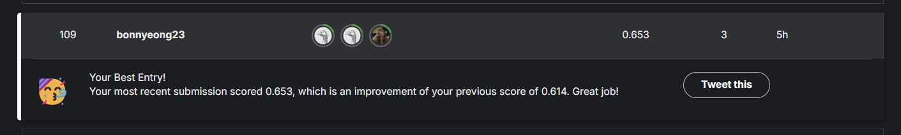

# Final Notebook README

## 🚗 Nexar DCP Challenge 전체 파이프라인 & 코드 리뷰

---

### 📍 **전체 목표**

- 비디오 데이터 (mp4)에서 프레임 기반 feature를 추출
- Temporal + Spatial Transformer로 충돌 예측 (binary classification)
- 최종 Kaggle submission 제출

---

### 🏗 **1️⃣ 데이터 전처리 파이프라인**

✅ **주요 내용**:

- 원본: `train_df` (비디오 ID + 라벨)
- 각 비디오에서 12프레임 추출
- 프레임당 feature:
    - spatial feature (1280 dim)
    - optical flow feature (1 dim)
    - **총 2049 dim** (주의! 이 값이 모델 입력으로 중요)

✅ **핵심 코드**:

```python

for idx, row in tqdm(train_df.iterrows(), total=len(train_df)):
    video_id = row['id']
    video_path = os.path.join(train_video_dir, f"{int(video_id):05d}.mp4")
    sequence = prepare_transformer_input(video_path, num_frames=12)

    if sequence is not None:
        all_sequences.append(sequence)
```

✅ **결과**:

- `all_sequences`: shape `(n_samples, 12, 2049)`
- `.npy` 파일로 저장 → 다음 단계에서 불러오기

✅ **리뷰**:

- 비디오 데이터 처리라 시간이 많이 걸림
- 중간에 `.npy` 저장 강력 추천!!! (다시 처리하는 걸 방지)

---

### 🏋️‍♂️ **2️⃣ Dataset & DataLoader 구성**

✅ **Dataset 클래스**:

```python

class VideoSequenceDataset(Dataset):
    def __init__(self, sequences, labels):
        self.sequences = torch.tensor(sequences, dtype=torch.float32)
        self.labels = torch.tensor(labels, dtype=torch.float32)

    def __getitem__(self, idx):
        return self.sequences[idx], self.labels[idx]
```

✅ **DataLoader**:

- 80/20 비율로 나누기 (train/validation split)
- `batch_size=16`

✅ **리뷰**:

- DataLoader shuffle: train=True, val=False
- large `.npy` 메모리 적재 주의 (RAM 제한 확인)

---

### 🧠 **3️⃣ 모델 설계 (Transformer 기반)**

### ✅ **Temporal Transformer**:

> “각 프레임에서 **그림 + 움직임 + 맥락**까지 다 보고 학습”
> 
- **입력: (batch, 12, 2049)**
    - 따라서 **backbone + optical flow + 추가 feature**까지 다 합친 2049 차원
- Linear projection → Transformer → mean pooling → (batch, 256)

### ✅ **Spatial Transformer**:

> CNN 같은 Backbone에서 추출한 per-frame(한 프레임 단위당) feature는 보통 1280 차원을 입력으로 받는다
> 
- **입력: (batch, 12, 1280)**
- Transformer → mean pooling → (batch, 1280)

<aside>

https://mytomato.tistory.com/66

</aside>

### ✅ **Combined Model**:

```python

combined = torch.cat([temporal_out, spatial_out], dim=1)  # (batch, 1536)
out = self.classifier(combined)                           # (batch, 1)
```

✅ **리뷰**:

- `temporal_input_dim` → 반드시 2049 (아니면 shape mismatch 발생!)
- 최종 classifier input dim → 256 + 1280 = 1536

---

### 🔥 **4️⃣ 학습 루프**

✅ **핵심 루프**:

```python

for epoch in range(num_epochs):
    for inputs, labels in train_loader:
        temporal_input = inputs[:, :, :2049]
        spatial_input = inputs[:, :, :1280]

        outputs = model(temporal_input, spatial_input)
        loss = criterion(outputs, labels)

        optimizer.zero_grad()
        loss.backward()
        optimizer.step()
```

✅ **리뷰**:

- 반드시 temporal/spatial slicing 정확히 맞추기
- optimizer: Adam (lr=1e-4), loss: BCELoss
- validation accuracy 모니터링 필수

---

### 💾 **5️⃣ 저장 & Submission**

✅ **중간 저장**:

- `.npy` or `.pt`로 feature/모델 저장 → 재훈련 방지

✅ **최종 제출**:

- Kaggle: Save & Run All → submission 생성

---

### 📌 **최종 메모**

- 파이프라인 속도 개선:
    - frame 수 줄이기
    - feature dim 축소
    - transformer layer/head 수 최적화
- 메모리 관리:
    - `.npy` 분리 저장
    - batch size 조정
- 제출 전: 로컬에서 전체 inference 돌려서 shape mismatch 없는지 확인

