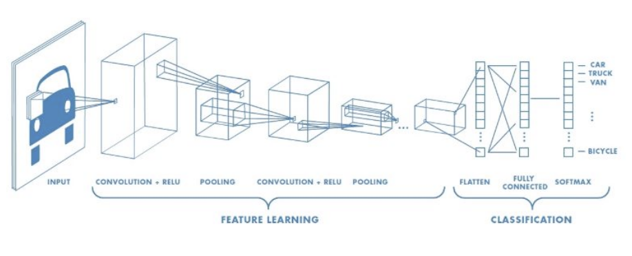

# 🚗 Nexar Dashcam Crash Prediction Challenge

<aside>
💡

대회: https://www.kaggle.com/competitions/nexar-collision-prediction/code

관련 논문: https://arxiv.org/pdf/2503.03848

참고 노트북: https://www.kaggle.com/code/fernandosr85/dashcam-collision-prediction-project

https://www.kaggle.com/code/sandiledesmondmfazi/nexar-dcp-challenge-baseline

참고 디스커션: https://www.kaggle.com/competitions/nexar-collision-prediction/discussion/564581

</aside>

### **📌 대회 정리**

| 주제 | 대시캠 영상을 활용한 사고 조기 예측 모델 개발 |
| --- | --- |
| 주최 | Nexar |
| 총 상금  | 총 $5,000 |
| 문제 유형  | 분류 (Classification) / 영상 기반 조기 예측 |
| 데이터 타입  | 도로 주행 영상 (1280×720, 30fps) |
| 평가 지표 | Mean Average Precision (mAP) at 500ms, 1000ms, 1500ms before accident |
| 대회 참가 팀 | 약 166여  |

# 1️⃣ 대회 개요

## 1. 대회 목표

- 자율주행 및 첨단 운전자 보조 시스템(ADAS)을 위한 사고 예측 모델 개발
- 사고 발생 이전에 위험 상황을 감지해 운전자가 충분한 대응 시간을 확보할 수 있도록 하는 것이 핵심

## 2. 데이터 소개

### 1) 비디오 유형

| 유형 | 설명 | 부가 정보 |
| --- | --- | --- |
| ✅ Positive | 실제 사고 또는 near-miss | `time_of_event`, `time_of_alert` 제공  |
| ❌ Negative | 정상 주행, 위험 상황 없음 | 시간 정보 없음  |

### 2) 데이터 구성 요약

📌 해상도: 1280 X 720 (30 FPS) 

| 구분 | 개수 | 길이 | 비고 |
| --- | --- | --- | --- |
| Train | 1,500개 | 약 40초 | Positive : Negative = 1:1 |
| Test | 1,344개 | 약 10초 | 리더보드용 / 최종 평가용 각 절반 |

### 3) 테스트 데이터 특징

- 영상은 사고 발생 전까지만 포함
- 종료 시점은 아래 중 하나
    - **사고 1500ms 전**
    - **사고 1000ms 전**
    - **사고 500ms 전**
- 실제 사고 시점은 공개되지 않음
- 모델은 각 영상에 대해 사고 가능성 score (0~1) 출력

## 3. 평가 지표

### 1) Time to Accident (TTA)

- 사고 시점(`time_of_event`)과 사고를 예측할 수 있었던 최초 시점(`time_of_alert`) 간의 간격
- 테스트셋에서는 사고 발생 전 **500ms / 1000ms / 1500ms** 시점에서의 예측 성능을 평가

### 2) 평가 절차

1. 각 TTA 구간별로 Precision-Recall (PR) 곡선을 작성
2. PR 곡선을 바탕으로 Average Precision (AP) 값을 계산
3. 최종 점수는 3개 TTA(500ms, 1000ms, 1500ms)에 대한 AP의 평균으로 산출

🔑 이 방식은 얼마나 조기에, 그리고 정확하게 사고를 예측했는지를 종합적으로 평가

### 3) Precision & Recall

| 개념 | 설명 | 공식 |
| --- | --- | --- |
| Precision (정밀도) | 예측한 Positive 중 실제로 Positive인 비율 | `TP / (TP + FP)` |
| Recall (재현율) | 실제 Positive 중에서 올바르게 예측한 비율 | `TP / (TP + FN)`  |

### 4) Anticipation Time (조기 예측 능력)

- 모델이 충돌을 얼마나 일찍 예측했는가를 평가하는 요소
- 평가 기준은 세 가지 시간 간격으로 나뉜다
    - 500ms 전
    - 1000ms 전
    - 1500ms 전
- 더 이른 시점에서 정확히 예측할수록 높은 점수를 받을 수 있다

---

# 📘 논문 요약

## 🔍 논문 목적

- 실제 도로 환경에서 교통 사고 예측을 위한 공개 데이터셋 및 챌린지 제안
- 자율주행 및 ADAS 시스템의 조기 사고 예측 연구를 촉진하기 위한 목표
- 모델이 충돌 전 특정 시점(`alert_time`)부터 사고를 예측할 수 있도록 설계됨

## 🎥 데이터셋 개요

| 데이터 수 | 총 1,500개 영상 (40초 분량) |
| --- | --- |
| 구성  | Positive (400 Collision + 350 Near-miss) / Negative (750 Normal) |
| 해상도 및 FPS | 1280×720, 30 FPS |
| 수집 방식 | Nexar 대시캠의 급제동 / 급가속 감지 시 자동 녹화 |
| 어노테이션 | `event_time` (사고 시점), `alert_time` (조기 인지 가능 시점) 포함 |
| 특성 | 다양한 조명/날씨/도로 환경 + 영상 왜곡 포함 (예: 빛 번짐, 블러 등) |
| 프라이버시 | 번호판/얼굴/음성 제거 등 엄격한 익명화 조치 적용 |

## 🕒 영상 구간 정의

1. Before Accident: 영상 시작 ~ `alert_time`
2. Alert Interval: `alert_time` ~ `event_time`
3. After Accident: `event_time` 이후

<aside>
📌

평균 `alert_to_event` 간격: 약 1.6초, 최대 4.5초

→ 사람의 반응 속도를 고려하면 사고 직전 예측은 자율주행에 특화된 난제

</aside>

## 🧪 챌린지 및 평가 방식

### 🎯 과제 목표

: 모델이 짧은 영상(약 10초)을 보고 사고가 일어날 가능성을 조기에 예측하는 것

- 입력: 영상 전체
- 출력: 사고 가능성 score (0~1 실수값)

### 🧪 테스트셋 구성

- 총 1,344개 영상
- `Positive` 케이스는 event 시점 기준으로 3개 TTA 버전(500ms/1000ms/1500ms)으로 분할
- `Negative`는 유사 분포의 fake time 사용
    
    ### 📌 왜 fake time이 필요한가?
    
    대회에서 모델은 **Positive인지 Negative인지 구분하는 확률 점수(0~1)를 출력**
    
    그런데 테스트셋에는 Positive 예시가 `time_of_event`, `time_of_alert` 기준으로 **사고 직전까지만 자른 영상**이 들어가 있다
    
    예를 들면,
    
    - 사고 영상은 40초짜리 영상 중, 사고 시점 1500ms 전에 끝나는 **10초짜리 부분만** 잘라서 제공
    - 이러면 모델은 "끝나는 타이밍" 자체로도 힌트를 얻을 수 있어 → 편향 생김
    
    👉 **그래서 Negative도 Positive처럼 보이게 맞춰줘야 함**
    
    ---
    
    ### 📍 구체적인 예시
    
    1. **Positive 영상 (사고 있음)**:
        - 항상 **사고 발생 직전까지**로 잘려 있다
        - 예: 사고 1500ms 전, 즉 **마지막 프레임이 항상 위험 직전**
    2. **Negative 영상 (사고 없음)**:
        - 만약 그냥 10초 랜덤 영상이라면, **사고로 이어질 듯한 위기 장면 없이 끝남**
    
    👉 이렇게 되면, 모델이 진짜 사고 여부를 보지 않고
    
    - **끝이 뭔가 급박하다 → Positive**
    - **끝이 너무 평온하고 느긋하다 → Negative**
    
    라고 판단하게 된다
    
    ---
    
    ### 🎯 어떤 편향(Bias)이 생길 수 있을까?
    
    1. **"영상의 마지막 몇 프레임"만 보고 판단하는 모델이 될 위험**
    
    - 마지막 1~2초에만 집중해서 예측 → 실제로는 전혀 사고를 인식한 게 아님
    - 이런 모델은 "겉보기에만 충실"하고, 실제 사고 예측력은 없음
    
    2. **실제 응용에서 무용지물**
    
    - 실제 서비스에서는 "이게 언제 끝날지" 모르는 상태에서 판단해야 함
    - 영상 종료 시점이 힌트가 되면, 테스트셋에서는 잘 작동해도 실전에서는 사용 못함
    
    ---
    
    ### 💡 시간적으로 영상이 끝나는 위치(구조) 때문에 생기는 편향
    
    → 모델이 프레임을 직접 보고 ‘위험해 보인다’고 판단하기보다는, 영상이 어디서 끝나는지를 은근슬쩍 학습해버린다
    
    예를 들어,
    
    - 영상이 “이상하게 10초 딱 되면 끊긴다” → 이건 사고 영상이다!
    - 영상이 “그냥 아무 일 없이 10초 흐르다가 끝나네” → 이건 정상 주행이다!
    
    <aside>
    
    따라서 Negative 영상도 마치 Positive처럼 사고 직전에서 잘린 것처럼 보이게 일부러 구조를 맞춤
    
    </aside>
    
    ---
    
    ### 🧪 어떻게 fake time을 설정하나?
    
    - Negative 예시(사고 없는 영상)에도 **가짜 event time / alert time**을 만들어서
        
        Positive처럼 “사고 직전까지만 잘린 영상처럼 보이게” 구성
        
    - 이 때, **진짜 사고가 없기 때문에**, time 값은 랜덤하게 생성된다
        - 평균적으로 영상 길이의 **중간쯤** (`video_length / 2`)에 event가 있다고 가정
        - 여기에 Gaussian noise (정규분포 노이즈)를 추가해서 다양하게 분포를 만들어냄
    - alert time도 비슷한 분포를 따르도록 **fake alert time**을 생성
    
    ---
    
    ### ✅ 그래서 어떻게 해결하나?
    
    - **Negative 영상도 Positive처럼 보이게 꾸며준다**
        
        → 종료 시점이 사고 직전인 것처럼 잘라버리는 것
        
    - 즉, **Negative도 Positive처럼 “중간에 갑자기 끝나게” 만들어**
        
        → 모델은 더 이상 종료 패턴만으로 구분할 수 없음
        
    
    ---
    
- 평가용 데이터셋은 공개/비공개 절반씩 구성

## 📊 평가 지표

| 평가 항목 | 설명 |
| --- | --- |
| AP (Average Precision) | 각 TTA 구간별 Precision-Recall 곡선 아래 면적 |
| mAP | `AP500`, `AP1000`, `AP1500`의 평균 |
| 특징 | 정확도 + 조기 예측 능력을 동시에 평가 |

⛑️ TTA가 길수록 더 어려운 예측이지만, 더 높은 보상을 받을 수 있음

## 💡 주요 기여 (Contributions)

- 새로운 고난이도 실제 환경 기반 사고 예측 데이터셋 공개
- 다양한 날씨, 조명, 도로 조건 포함  + 실시간 판단이 어려운 단시간 이벤트 다수 포함
- 어노테이션 신뢰도 확보를 위해 복수 주석자 기반 통계적 처리
- Kaggle 챌린지를 통해 표준화된 벤치마크 환경 제공
- 인간의 반응 속도를 넘어서는 사고 예측까지 고려 → 자율주행 연구에 특화된 구성

## 🚀 향후 연구 방향 (Future Directions)

- 데이터셋 확장: 더 다양한 지역/교통 시나리오 반영
- 추가 정보 수집: 차량 유형, 운전자 행동, 도로 인프라 등
- 복잡한 상호작용/극한 환경 포함 → 완전한 사고 예측 플랫폼으로 발전 가

---

https://www.kaggle.com/competitions/nexar-collision-prediction/discussion/564581

# 🚗 **Crash Prediction Competition 해결 전략**

## 1️⃣ 데이터 전처리 및 EDA

### 1) CSV 및 영상 분석

- 메타데이터 활용: `time_of_event`, `time_of_alert` 정보를 통해 사고 타이밍 파악
- 주요 프레임 추출: 대부분의 충돌이 영상 중반에 발생 (~40초), 이 구간에 집중
- 영상 해상도 표준화: 1280×720 해상도로 맞추고, 밝기 조정
- 공간적 크롭 및 샘플링: 사고 전의 프레임을 선택하고, 차량 주위로 크롭

### 2) 정규화 및 증강

- 시간적 샘플링: 충돌 이벤트 직접 프레임을 선택하여 모델에 제공
- 공간적 증강: 랜덤 회전, 스케일링, 이동 등 다양한 기법을 적용

## 2️⃣ 모델 아키텍처

### **1) 3D CNN Approach**

- NFL 해결법 참조: 3D CNN (예: ResNet50-irCSN)을 사용하여 공간-시간 특성을 추출
- 멀티뷰 입력: 여러 대시캠 각도 활용 시 모델 성능 향상

### 2) Transformer 및 혼합 모델

- CNN + Transformer 결합: CNN으로 추출한 특성에 Transformer 레이어를 추가해 긴 시간적 의존성을 캡처
- 하이브리드 아키텍처: CNN + RNN/Transformer 결합 방식 실험

### 3) 광학 흐름 및 모션 특징

- 광학 흐름: 차량의 동적 움직임을 잘 포착하고, 충돌 예측에 활용

### ⛑️ 참고 개념

## 🧠 1. CNN (Convolutional Neural Network)

: 이미지를 인식하거나 분석하는 데 특화된 딥러닝 모델 구조

- 이미지 위에 작은 필터(커널)를 이동시키며 패턴을 추출 (합성곱 연산)
- 초반에는 선, 모서리 같은 단순한 특징 → 깊어질수록 형태, 구조까지 인식
- 자율주행 영상에서는 차량의 형태, 움직임 등 시각적 특징 추출에 활용됨

🔑 예시: 고양이 사진에서 귀, 눈, 수염 → 고양이 전체를 인식

## 🧱 2. ResNet (Residual Network)

: 깊은 CNN 구조에서 학습 안정성을 높이기 위한 모델 구조

- Skip Connection을 통해 입력을 레어어를 건너뛰어 다음으로 전달
- 깊은 네트워크에서도 정보 손실 없이 안정적인 학습이 가능
- 일반 CNN보다 더 많은 레이어를 쌓아도 성능이 떨어지지 않음

## 🤖 3. Transformer

: 여러 입력(문장, 프레임 등) 사이의 관계를 동시에 전역적으로 비교하면서, 어떤 정보가 중요한지 판단하는 모델 

<aside>

→ 즉, 전통적인 RNN(Recurrent Neural Network)은 순서대로 처리하지만, Transformer 모델은 입력 시퀀스의 모든 위치에 대해 **동시에** 집중하여 정보를 처리한다. 마치 우리가 긴 문장을 읽을 때, 특정 단어에 더 집중하면서 전체적인 의미를 파악하는 방식과 유사하다. 

</aside>

- 기존 RNN의 한계점
    - 장기 의존성 문제: 문장이 길어질수록 앞부분의 정보가 뒤쪽까지 잘 전달되지 못하는 문
    - 병렬 처리의 어려움: 순차적인 처리 방식 때문에 GPU와 같은 병렬 컴퓨팅 자원을 효율적으로 활용하기 어려움

### 🧭 Self-Attention (자기 주의 메커니즘)

- 입력 내 모든 요소를 서로 비교해 어떤 정보가 중요한지 학습

<aside>

`"The cat sat on the mat”`

</aside>

- “cat”은 “mat”과 관계가 있으므로 → attention score 증가
- “the”는 거의 모든 단어에 대해 attention score 감소

 💡 예시 (영상):

: 특정 프레임의 움직임이 갑자기 커졌다면, 이전 프레임들과의 관계를 고려해서 사고 발생 가능성을 학습함

### 🔄 Multi-Head Self-Attention

: Attention을 한 번이 아니라 여러 번 서로 다르게 적용해서 더 풍부한 관계를 파악

1. 여러 개의 독립적인 셀프 어텐션 메커니즘을 병렬로 수행
2. 이를 통해 다양한 관점에서 입력 시퀀스 내의 관계를 파악할 수 있음 
3. 각 헤드에서 얻은 결과를 합쳐 최종 출력을 만듦

📌 예: 어떤 헤드는 “속도 변화”를 보고, 어떤 헤드는 “위치 관계”를 본다 

## 3️⃣ 데이터 증강 및 정규화

### 1) 시간적 증강

- Random Time Warping (랜덤 타임워핑): 시간 왜곡 및 프레임 드랍을 통해 다양한 충돌 타이밍을 시뮬레이션
    - 시계열 데이터나 영상 데이터에 적용하는 시간 축 데이터 증강 기법을 말한다.
    - 쉽게 말해, 시간을 조금 느리게 / 빠르게 / 일그러지게 해서 모델이 다양한 속도의 상황에도 견디게 만드는 증강 기법
    
    🔑 어떤 사고는 급발진으로 매우 빠르게 벌어지고, 어떤 사고는 서서히 위험해지다가 발생하기 때문에 원래의 시계열/프레임 순서를 미세하게 왜곡해서 새로운 데이터를 만들어냄 
    

### 2) 공간적 증강

- Affine 변환: 회전, 스케일링, 이동 등 다양한 공간적 증강
    
    : 선형 변환(Linear Transformation)과 평행 이동(Translation)을 결합한 변환으로 쉽게 말해, 모양은 유지하면서 위치, 크기, 기울어짐 등을 바꿀 수 있는 변환
    
    💡 핵심 아이디어
    
    - 직선은 직선으로 유지: 변환 후에도 원래 직선이었던 것은 여전히 직선
    - 평행선은 평행선으로 유지
    - 점의 상대적인 비율 유지: 직선 위에 있는 점들의 상대적인 거리는 변환 후에도 유지
    
    ### 📚 선형 변환 (Linear Transformation)
    
    - 스케일링 (Scaling): 객체의 크기를 늘리거나 줄여, 각 축 방향으로 다른 비율로 스케일링 가능
    - 회전 (Rotation): 객체를 특정 각도만큼 회전
    - 밀림 (Shearing): 객체를 한 쪽 방향으로 기울임
    
    ### ⚒️ 평행 이동 (Translation)
    
    - 객체를 특정 방향으로 일정 거리만큼 이동시킴
- 밝기/대비 조정: 날씨나 조명에 따른 데이터 다양성 보장

### 3) 정규화 기법

- Dropout, Stochastic Depth, AWP(Adversarial Weight Perturbation) 등을 이용해 과적합 방지

### ⛑️ 참고 기법

### 1️⃣ Dropout

> 뉴런 일부를 무작위로 꺼서 과적합 방지
> 

### 2️⃣ Stochastic Depth

> 레이어 자체를 랜덤하게 스킵하는 Dropout의 확장 버전 (특히 Resnet 계열에서 자주 사용)
> 
- 학습 중에 전체 레이어를 통째로 생략하는 방식
- 테스트할 때는 전체 구조를 다시 사용함
- 레이어 깊이가 매번 다르게 되므로, 다양한 깊이의 서브 모델을 학습 → 과적합 방지 + 더 강건한 학습 가능

### 3️⃣ AWP (Adversarial Weight Pertubation)

> 모델의 가중치(weights)를 적대적으로 교한하여 모델이 훈련 데이터의 작은 변화에 덜 민감하게 만들고, 더 평탄한 손실 함수 영역으로 수렴하도록 유도하는 정규화 기법
> 
- weight를 일부러 나쁜 방향으로 살짝 흔든 뒤 학습
- 즉, 모델에게 불리한 조건을 일부러 주고 훈련시켜서 강인함을 키움

## 4️⃣ 후처리 및 앙상블 기법

### 1) 시간적 스무딩

- 슬라이딩 윈도우 필터링 또는 시간적 NMS (Non-Maximum Suppression)를 적용해 예측을 부드럽게 처리

### 📚 NMS란?

> 주로 객체 감지(Object Detection) 분야에서 사용되고, 여러 개의 겹치는 예측 중에서, 가장 확실한 것 하나만 남기고 나머지를 제거하는 후처리 기법
> 

### ⏱️ 시간적 NMS (Temporal NMS)

> 시간 축에서 겹치는 또는 유사한 예측들을 제거하고, 가장 신뢰도 높은 시점 하나만 남기는 후처리 기법
> 
1. 예측 점수를 score 순으로 정령
2. 정해진 시간 간격 이내(예: ±500ms)에 있는 예측 중 → 낮은 score 제거
3. 남은 예측들로 반복  

### 💡 왜 NMS가 필요할까?

: 객체 감지 모델은 이미지 내의 여러 객체의 위치와 종류를 동시에 예측한다. 이때 다음과 같은 이유로 하나의 객체에 대해 여러 개의 바운딩 박스가 예측될 수 있다. 

- 겹치는 수용 영역(Overlapping Receptive Fields): CNN의 특징 추출 과정에서 여러 개의 필터가 하나의 객체의 다양한 부분 감지 가능성
- 앵커 박스(Anchor Boxes): 많은 객체 감지 모델은 미리 정의된 다양한 크기와 비율의 앵커 박스를 사용하여 객체의 위치를 예측한다. 하나의 객체에 대해 여러 개의 앵커 박스가 적합할 수 있다

<aside>

https://ploradoaa.tistory.com/121

</aside>

### 2) 앙상블

- 여러 모델(예: 3D CNN, Transformer 기반 모델)을 단순 평균 또는 XGBoost 기반 후처리로 결합하여 예측 성능 향상

## 5️⃣ 이전 대회에서의 영감

### 1) NFL 대회 해결법

- 다중 뷰 처리 및 추적 데이터 활용: 여러 대시캠 시각을 융합하여 예측 성능 강화

### 2) YouTube-8M 전략

- 후보 생성 및 세그먼트 레벨 재정렬 기법을 이용해 충돌 이벤트를 조기에 로컬라이징할 수 있음

### 3) ASL 손말 인식

- 정규화, 랜드마크 추출, 창의적인 증강 (예: CutMix, Time Masking) 기법을 도입하여 효과적인 특성 추출

## 6️⃣ 결론: 최적의 모델 구축을 위한 핵심 포인트

- 정확한 시간적 위치 파악이 중요
- 강력한 데이터 증강 및 정규화로 모델의 강건성 강화
- 혼합된 공간-시간 모델을 통해 보다 정교한 예측
- 앙상블 기법을 통한 예측 성능 극대화

---

https://www.kaggle.com/code/fernandosr85/dashcam-collision-prediction-project

# 1. Data Preprocessing

> 원본 영상에서 충돌 위험 예측에 중요한 장면만 뽑아내고, 다양한 주행 상황을 시뮬레이션해서 모델이 다양한 상황에 견디도록 하는 데이터 가공 단계
> 
- 중요 프레임 추출 (Keyframe Extraction)
- 광학적 흐름(Optical Flow) 계산 - 모션을 숫자로 표현하기
    
    > 자동차의 움직임을 픽셀 단위로 감지
    > 
    - 프레임 1과 프레임 2사이에서 어떤 물체가 어디로 이동했는지 측정
    - 예를 들어, 차량이 오른쪽으로 10픽셀 이동했다면 → `(dx=10, dy=0)` 식으로 기록
    - 해당 코드에서는 Farneback 알고리즘 사용 → 속도도 빠르고, 부드럽게 흐름을 계산할 수 있어 영상 처리에 적합
- 주행 조건 시뮬레이션을 위한 데이터 증강
- 병렬 처리 (Parallel Processing)
    - 파이썬의 `multiprocessing.Pool`을 사용해 여러 개의 영상 프레임을 동시에 병렬 처리 → 전처리 속도 향상
- 결측 프레임 처리

# 2. Feature Engineering & Extraction

> 충돌이 발생하기 직전의 특징(모양 + 움직임)을 잘 표현하고, 영상 간 시간 흐름이 잘 보존되도록 하는 데이터 가공 단계
> 

### 1) 적응적 프레임 샘플링

- 충돌이 발생하는 후반부 프레임을 중심으로 더 많이 뽑음

### 2) Farneback Optical Flow로 움직임 표현

- 픽셀 간 움직임을 화살표(벡터)로 표현
    
    → 움직임이 심해지는 순간 = 사고 가능성 증가로 인식
    

### 3) 현실적인 증강 기법

- 수평 뒤집기, 밝기 조정, 비, 안개 등을 적용해 모델이 다양한 날씨 및 조명 상황에서도 잘 예측하도록 학습

### 4) 시간 정보 유지 변환 (Temporal Coherence)

- 프레임을 증강할 때, 시간 순서가 흐트러지지 않도록 조심함

### 5) NumPy → PyTorch 변환 최적화

<aside>

### 🔄 왜 NumPy에서 PyTorch로 변환해야 할까?

- 대부분 영상 전처리/프레임 추출/광학 흐름 계산은 OpenCV + NumPy를 사용해서 처리 → 데이터는 NumPy 배열로 만들어졌지만, 모델은 PyTorch tensor를 원하기 때문
- `torch.from_numpy()`

### ⚒️ 배치 차원 유지

- PyTorch 모델은 입력 데이터를 [B, C, H, W] 구조로 받기 때문에 NumPy에서도 이 구조로 맞춰줘야 모델이 정상 작동
    - B: 배치 수
    - C: 채널
    - H: 높이
    - W: 너비

### 🔑 변환 방법

1. NumPy로 영상 프레임/광학 흐름 등 처리
2. `.astype(np.float32)`로 타입 맞추기 (`float64` → `float32`로 변환)
3. `torch.from_numpy()`로 tensor 변환
4. `.unsqueeze(0)`으로 배치 차원 추가 (필요시)
5. `.to(device)`로 CPU에서 GPU로 전송 (필요시) 
</aside>

- 영상 데이터를 모델에 넣을 수 있게 변환할 때, 배치 단위와 시간 차원을 유지하면서 빠르게 변환

# 3. 멀티 스트림 구조 (Multi-Stream Architecture)

> 모양(정적 정보)과 움직임(동적 정보)을 따로따로 학습한 뒤, 결합해서 더 정확한 예측을 만드는 구조
> 

### 1) 시각 스트림 (Visual Stream)

- MobileNetV2 기반 경량 CNN으로 프레임의 이미지 정보(차 모양, 배경 등)를 추출

### 2) 광학 흐름 스트림 (Motion Stream)

- Optical Flow를 입력으로 받아서 3D CNN을 통해 시간에 따른 움직임 변화를 학습
- 3D CNN은 여러 프레임을 동시에 받아 시간적 변화까지 인식

### 3) 시간 모델링 (LSTM)

- 영상은 시간에 따라 변화하는 시퀀스 데이터이므로 LSTM으로 프레임 간의 흐름 (예: 정지 → 이동 → 충돌)을 학습

### 4) 특징 결합 (Feature Fusion)

- 시각 스트림과 모션 스트림의 출력 특징을 결합해 공간 + 시간 정보가 합쳐진 예측 생성

### 5) 경량 구조 구현

- 모바일 환경 또는 제한된 GPU에서도 학습 및 추론이 가능하도록 전체 구조를 최적화된 형태로 경량화

# 4. 모델 최적화 (Model Optimization)

- 비디오 배치 처리 시 메모리 최소화
- GPU를 우선 사용하되, 자동으로 CPU fallback 처리
- Gradient Clipping으로 학습이 폭주하지 않도록 안정화
    
    <aside>
    
    https://yhyun225.tistory.com/22
    
    https://velog.io/@lighthouse97/%EC%97%AD%EC%A0%84%ED%8C%8CBackpropagation-%EC%95%8C%EA%B3%A0%EB%A6%AC%EC%A6%98
    
    → 딥러닝에서 역전파(Back Propagation) 알고리즘을 사용할 때, 가중치를 업데이터 하기 위해 기울기를 계산하는데, 가끔 기울기 값이 너무 커져서 가중치가 한 번에 너무 크게 바뀌면 모델이 아예 폭주하게 된다. 
    
    ### ⚒️ Gradient Clipping이란?
    
    > 기울기(Gradient)가 일정 값 이상 커지면 잘라주는 것
    > 
    </aside>
    
- ReduceLROnPlateau 스케쥴러로 학습률 자동 조절
    
    <aside>
    
    ### ⛑️  ReduceLRoNPlateau (학습률 스케줄러)
    
    → 학습률은 딥러닝 학습에서 매우 중요한 하이퍼파라미터
    
    그런데 모델이 잘 학습되다가 어느 순간 성능 향상이 멈추는 Plateau(고원) 상태가 온다 → 학습률을 줄여 더 세밀하게 조정 
    
    </aside>
    
- Checkpoint 저장으로 가장 좋은 모델 자동 저장
    - 수백~수천 epoch 동안, 그 중에서 가장 성능이 좋은 시점을 저장

# 5. 커스텀 손실 함수 (Custom Loss Function)

- 이진 분류(Binary Classification) + 시간 예측 회귀(Regression) 혼합
- 늦게 사고를 예측할수록 패널티를 부여하는 구조
- 충돌 예측 정확도뿐만 아니라, 얼마나 일찍 예측했는가도 중요하게 평가
- 실제 안전 운전 시나리오를 고려해 설계된 손실 함수
