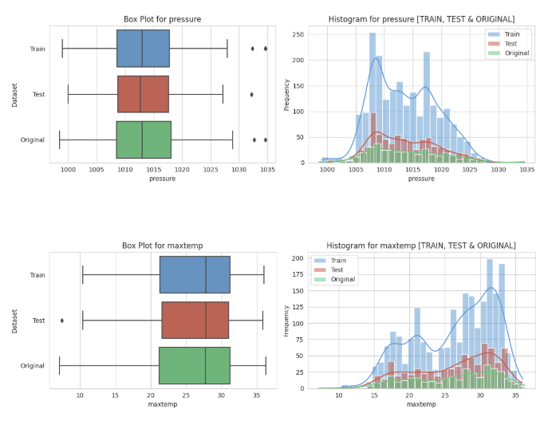

# ☔Rainfall Prediction

작성일시: 2025년 3월 8일 오후 11:46

## **Binary Prediction with a Rainfall Dataset**

**📂 2025 Kaggle Playground Series**

## **📚 Reference Code**

- **🌧️Rainfall Pred☔ | EDA📈 + Modelling | 🤖AI News!** [https://www.kaggle.com/code/tarundirector/rainfall-pred-eda-modelling-ai-news/notebook](https://www.kaggle.com/code/tarundirector/rainfall-pred-eda-modelling-ai-news/notebook)
- **🌧️ Rainfall Prediction | 🏗️ Stacking**
    
    [https://www.kaggle.com/code/mariusborel/rainfall-prediction-stacking](https://www.kaggle.com/code/mariusborel/rainfall-prediction-stacking)
    

## 1. 데이터 소개

### 1-1. 데이터셋 형태 📂

- 훈련 데이터: 2,190행 x 13열
- 테스트 데이터: 730행 x 12열
- 원본 데이터: 366행 x 12열

### 1-2. 결측치 분석 ❌

- 훈련 데이터셋: 결측치 없음
- **테스트 데이터셋:** `winddirection` 피처에 1개의 결측치 존재
    - 중앙값 대치를 통해 결측치 처리

### 1-3. 데이터 소개

다음은 데이터셋의 변수들을 표로 정리한 것입니다:

| **변수명** | **설명** | **범위/특성** |
| --- | --- | --- |
| ID | 레코드의 고유 식별자 | - |
| Day | 연중 일수 | 1 ~ 365 |
| Pressure | 기압 | 999 ~ 1034.6 hPa |
| Temperature | 온도 (최대, 최소, 평균) | 최대: 10.4°C ~ 36.0°C최소: 4.0°C ~ 29.8°C |
| Dew Point | 이슬점 | -0.3°C ~ 26.7°C |
| Humidity | 습도 | 39% ~ 98% |
| Cloud Cover | 구름량 | 2% ~ 100% |
| Sunshine Duration | 일조 시간 | 0 ~ 12.1 시간 |
| Wind Speed | 풍속 | 4.4 km/h ~ 59.5 km/h |
| Wind Direction | 풍향 | 범주형 (35개 고유 값) |
| Rainfall | 이진 타겟 변수 | 0 = 비 없음, 1 = 비 있음 |

## 2. EDA

목표: 탐색적 데이터 분석을 통해 데이터를 더 깊이 이해하고, 모델링에 필요한 정보 얻는 단계

### 2-1. 수치형 변수 분석 📚

- 히스토그램을 사용하여 각 변수의 분포 확인
- 박스플롯을 사용해 잠재적 이상치를 식별하고 데이터 분포 평가
- numerical_variables → winddirection, pressure, maxtemp, temparature, mintemp, dewpoint, humidity, cloud, sunshine, windspeed

| **변수** | **분포 특성** | **이상치/특이점** |
| --- | --- | --- |
| 기압 (pressure) 🌡️ | 정규 분포 | 1030 hPa 이상 (고기압) |
| 최대 온도 (maxtemp) ☀️ | 좌편향, 이중봉 분포 | 10°C 이하 (추운 날) |
| 평균 온도 (temperature) 🌡️ | 좌편향, 이중봉 분포 | 4°C ~ 7°C (추운 날) |
| 최소 온도 (mintemp) ❄️ | 좌편향 | 4°C ~ 7°C (추운 밤) |
| 이슬점 (dewpoint) 💧 | 좌편향, 20-25°C 집중 | 0°C ~ 5°C (건조) |
| 습도 (humidity) 🌫️ | 좌편향, 70% 이상 집중 | 40-50% (건조) |
| 구름량 (cloud) ☁️ | 좌편향, 80-100% 최고점 | 0-30% (맑은 날) |
| 일조 시간 (sunshine) 🌞 | 우편향, 0에 가까운 값 다수 | 10-12시간 (맑은 날) |
| 풍향 (winddirection) 🌬️ | 이중봉 분포 | 주요 패턴: ~50° 및 ~200° |
| 풍속 (windspeed) 🍃 | 우편향, 30km/h 미만 집중 | 45km/h 이상 (폭풍/강풍) |
- 극좌표 그래프를 통해 풍향과 풍속 특성 파악
    - 극좌표 그래프: 일반적인 직교 좌표계(x축, y축) 대신, 원점으로부터의 거리(r)와 각도(θ)를 사용하여 점의 위치를 나타내는 그래프
    - 풍향과 레이더 데이터 시각화에 적합

→ 비가 올 때: 중간 정도의 풍속이 주로 나타나며, 바람의 방향과 세기가 고르게 분포

→ 비가 오지 않을 때: 바람의 방향과 세기가 불규칙하게 분포

- 연간 변화 추이를 라인 플롯으로 시각화 → 'day' 변수 기반 특성 분석

### 2-2. 범주형 변수 분석 🔠

- 카운트플롯을 사용해 범주별 빈도를 분석하고 불균형 감지
- 파이 차이를 사용해 데이터셋 내 범주별 비율을 시각화
- categorical_variables

### 2-3. 타겟 변수 분석 🎯

- 타겟 변수(rainfall)는 이진 변수(비/비 없음)이므로 분포를 확인하여 클래스 불균형 이해
- 막대 차트와 KDE 플롯을 사용해 다른 변수와의 관계 시각화

### **📝 주요 상관관계 분석**

| **변수 관계** | **상관계수** | **분석 내용** | **후속 조치** |
| --- | --- | --- | --- |
| 온도 관련 변수들
(최대/평균/최소) | 0.97-0.99
(강한 양의 상관관계) | 온도 관련 변수들 간 중복성이 매우 높음 | 특성 선택 또는 PCA를 통한 차원 축소 고려 |
| 구름량과 습도 | 0.58
(강한 양의 상관관계) | 구름량이 높을수록 습도가 증가하는 경향 | 스케일링 또는 변수 변환을 통한 모델 성능 개선 |
| 구름량과 일조시간 | -0.81
(강한 음의 상관관계) | 구름량이 많을수록 일조시간 감소 | 두 변수의 유사성을 고려한 특성 선택 |
| 풍속과 구름량 | -0.18
(약한 음의 상관관계) | 강한 바람이 구름 형성을 감소시킬 수 있음 | 바람-구름 상호작용에 대한 추가 특성 공학 |
| 온도와 습도 | -0.025
(매우 약한 음의 상관관계) | 습도는 온도 외 다른 요인들의 영향을 받음 | 다른 변수들과의 복합적 관계 분석 |
| 풍향과 풍속 | -0.19
(약한 음의 상관관계) | 특정 풍향에서 더 강하거나 약한 바람이 관측됨 | 풍향의 범주화를 통한 인사이트 도출 |

## 4. Feature Engineering

### **4-1. 파생 변수 생성**

| **파생 변수명** | **설명** | **유형** |
| --- | --- | --- |
| Temp_Diff | 최대 온도와 최소 온도 차이 | 수치형 |
| Dew_Point_Spread | 온도와 이슬점 차이 | 수치형 |
| Humidity_Category | 습도를 'Low', 'Medium', 'High'로 범주화 | 범주형 |
| Cloud_Cover_Category | 구름량을 'Clear', 'Partly Cloudy', 'Overcast'로 범주화 | 범주형 |
| Sunshine_Category | 일조 시간을 'Low', 'Medium', 'High'로 범주화 | 범주형 |
| Wind_Speed_Intensity | 풍속을 'Calm', 'Breezy', 'Windy'로 범주화 | 범주형 |
| Wind_Quadrant | 풍향을 'NE', 'SE', 'SW', 'NW' 4분면으로 범주화 | 범주형 |
| Pressure_Humidity_Interaction | 기압과 습도의 곱 | 수치형 (상호작용 특성) |
| Wind_Cloud_Interaction | 풍속과 구름량의 곱 | 수치형 (상호작용 특성) |
| Temp_Ratio | 최대 온도 대비 현재 온도 비율 | 수치형 (정규화) |
| month | 연간 월 (1~12) | 범주형 (순서형) |
| temp_previous_day | 하루 전 온도 | 수치형 (시차 특성) |
| humidity_previous_day | 하루 전 습도 | 수치형 (시차 특성) |
| pressure_previous_day | 하루 전 기압 | 수치형 (시차 특성) |
| Day_sin | 하루의 sin 값 (계절성 반영) | 수치형 (변환) |
| Day_cos | 하루의 cos 값 (계절성 반영) | 수치형 (변환) |
| Wind_U | 풍속의 동서 방향 벡터 성분 | 수치형 (벡터화) |
| Wind_V | 풍속의 남북 방향 벡터 성분 | 수치형 (벡터화) |

📌 노란색 변수들이 새롭게 생성된 파생 변수 목록 

1. 월 (month) 변수 생성
    1. month 변수는 day 값을 12개의 구간으로 나누어 월별 정보를 나타냄
    2. 데이터의 계절성 또는 월별 패턴을 모델에 반영하는 역할 
2. 과거 데이터 활용 변수 생성
    1. temp_previous_day, humidity_previous_day, pressure_previous_day 
    2. 과거 데이터를 활용해 시간의 흐름에 따른 변화 반영
3. 주기 함수 변환 (Day 변수)
    1. Day_sin, Day_cos 변수는 day 변수를 날짜의 주기적인 특성을 학습하도록  삼각 함수(sin, cos)를 사용해 날짜를 원형으로 표현하는 것이 효과적 
    2. **df[’Day_sin’] = np.sin(2 * np.pi * df[’day’] / 365)**
    3. **df[’Day_cos’] = np.cos(2 * np.pi * df[’day’] / 365)**
4. 풍향/풍속 벡터화
    1. 풍향을 범주형으로 변환하는 것보다 모델이 바람의 방향과 세기를 더 효과적으로 학습할 수 있도록 도움 
        - **Wind_U: 동-서 방향의 바람 (양수면 동쪽, 음수면 서쪽)**
        - **Wind_V: 북-남 방향의 바람 (양수면 북쪽, 음수면 남쪽)**

### **4-2. 분포 변환**

왜도가 0.75를 초과하는 수치형 특성에 로그 변환을 적용 

→ 테스트 데이터(windspeed)의 왜곡된 수치형 특성 로그 변환 및 분포 시각화

### 4-3. Feature Encoding

- 범주형 변수 원-핫 인코딩
    - Cloud_Cover_Category, Humidity_Category, Sunshine_Category, Wind_Quadrant, Wind_Speed_Intensity

### **4-4. Feature Scaling**

- **MinMaxScaler**
- **StandardScaler**

## **5. Modeling**

🔑 optuna를 활용한 XGBoost, CatBoost, LightGBM 모델 하이퍼파라미터 최적화 

- 평가 방법: 5-Fold 교차 검증의 각 단계에서 모델 성능을 ROC AUC로 측정하고, 최종적으로 평균 ROC AUC를 계산
- 결과 요약

| 모델  | 스케일링 | 평균 AUC | 표준편차 |
| --- | --- | --- | --- |
| CatBoost | MinMaxScaler | 0.882632 | 0.011941 |
| CatBoost | StandardScaler | 0.882602 | 0.014613 |
| LightGBM | MinMaxScaler | 0.882291 | 0.012140 |
| XGBoost | MinMaxScaler | 0.881002 | 0.011872 |
| XGBoost | StandardScaler | 0.880419 | 0.013256 |
| LightGBM | StandardScaler | 0.876369 | 0.011354 |

📂 주요 결과

- CatBoost 모델이 MinMaxScaler를 사용했을 때 가장 높은 AUC를 기록
- 모든 모델이 비슷한 수준의 성능을 보였으며, 표준편차는 크지 않았음

📕 **참조 코드의 ROC Curve 결과** 

📘 **CatBoost 모델로 변경했을 때의 ROC Curve 결과** 

### ✨ Feature Importance

## **6. 스태킹**

### 1. 특성 선택

- 목표: CatBoost 모델의 특성 중요도 분석 결과를 바탕으로 모델 성능에 중요한 특성만 선택
- 방법: 중요도가 4 이상인 특성들을 선택하여 FeatureSelector 클래스를 통해 데이터 반환
- 선택된 특성: `cloud`, `sunshine`, `Pressure_Humidity_Interaction`, `Day_sin`, `humidity`, `Wind_Cloud_Interaction`, `Wind_U`, `Dew_Point_Spread`, `humidity_previous_day`, `dewpoint`, `Day_cos`, `Temp_Diff`, `Cloud_Cover_Category_Overcast`, `mintemp`, `windspeed`

### **2. 스태킹 앙상블 모델 구축 (1)**

- 목표: CatBoost, LightGBM, XGBoost 모델을 결합하여 예측 성능 향상
- 방법: StackingClassifier를 사용해 각 모델을 기본 모델로 구성하고, LightGBM을 최종 메타 모델로 사용
    - XGBoost나 CatBoost에 비해 학습 속도가 빠르기 때문에 최종 메타 모델로 사용
- 모델 파라미터: Optuna를 통해 하이퍼파라미터 사용
- 데이터 스케일링: 모든 모델에 MinMaxScaler 적용

### 3. 모델 학습 및 평가

- 데이터 분할: 훈련 데이터를 학습 데이터와 검증 데이터로 분할 (8:2 비율)
- 모델 학습: 스태킹 모델을 학습 데이터로 학습
- 모델 예측: 검증 데이터로 예측 수행
- 모델 평가: ROC-AUC 점수 및 분류 보고서(precision, recall, f1-score)를 통해 모델 성능 평가

**📕 참조한 코드의 AUC_Score 결과** 

**📘 변경된 코드의 AUC_Score 결과**

### **4. 스태킹 앙상블 모델 구축 (2)**

- 목표: 위 모델에 Random Forest를 포함한 스태킹 진행
- 랜덤 포레스트 모델 파라미터: 동일하게 Optuna를 통해 하이퍼파라미터 사용

📌 이외에도 `LogisticRegression`, `RandomForestClassifier`, `GradientBoostingClassifier` 와 같은 다양한 모델 조합을 추가적으로 진행해볼 수 있다